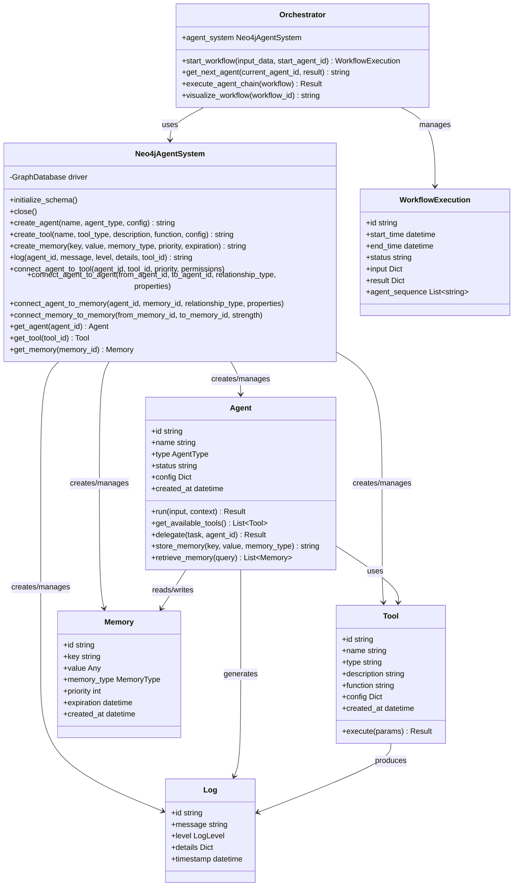

# Neo4j Agents - Graph-Based Agentic Framework

A Python library for building, managing, and orchestrating AI agent systems using Neo4j as the underlying database for agents, tools, memory, and logging.

## Architecture

The library is designed around a graph-based architecture where agent relationships, memory, and execution paths are all stored in Neo4j.

### Class Diagram

## Key Features

- **Dynamic Agent Orchestration**: Agent sequences adapt based on input or previous outcomes
- **System Introspection & Monitoring**: Every step in agent processing is tracked in the graph
- **Decentralized Configuration**: Agent behaviors and connections are defined as graph properties
- **Comprehensive Logging & Debugging**: Logs connected directly to relevant agents, tools, and memory
- **Scalable Multi-Agent Design**: Easily add new agent types for specific functions
