# NexusAgents - Graph-Based Agentic Framework

A Python library for building, managing, and orchestrating AI agent systems using Neo4j as the underlying graph database for agents, tools, memory, and logging.

## Architecture

The library is designed around a modular, graph-based architecture where agent relationships, memory, and execution paths are all stored in Neo4j. The system follows clean separation of concerns with individual managers for different entity types.

### Class Diagram

```mermaid
classDiagram
    class NexusCore {
        -GraphDatabase driver
        +initialize_schema()
        +close()
        +get_session() Session
        +run_query(query, params) Result
    }
    
    class AgentManager {
        -NexusCore core
        +create_agent(name, agent_type, config) string
        +get_agent(agent_id) Agent
        +update_agent(agent_id, properties) bool
        +delete_agent(agent_id) bool
        +list_agents(filters) List~Agent~
        +connect_agents(from_id, to_id, relationship_type, properties) bool
    }
    
    class ToolManager {
        -NexusCore core
        +create_tool(name, tool_type, description, function, config) string
        +get_tool(tool_id) Tool
        +update_tool(tool_id, properties) bool
        +delete_tool(tool_id) bool
        +list_tools(filters) List~Tool~
    }
    
    class MemoryManager {
        -NexusCore core
        +create_memory(key, value, memory_type, priority, expiration) string
        +get_memory(memory_id) Memory
        +update_memory(memory_id, properties) bool
        +delete_memory(memory_id) bool
        +search_memories(query, filters) List~Memory~
        +connect_memories(from_id, to_id, strength) bool
    }
    
    class RelationshipManager {
        -NexusCore core
        +create_relationship(from_id, from_type, to_id, to_type, rel_type, properties) bool
        +get_relationship(from_id, to_id, rel_type) Relationship
        +update_relationship(from_id, to_id, rel_type, properties) bool
        +delete_relationship(from_id, to_id, rel_type) bool
        +get_neighbors(node_id, rel_type, direction) List~Node~
    }
    
    class LogManager {
        -NexusCore core
        +log(source_id, source_type, message, level, details) string
        +get_logs(filters) List~Log~
        +search_logs(query) List~Log~
    }

    class Agent {
        +id string
        +name string
        +type AgentType
        +status string
        +config Dict
        +created_at datetime
        +run(input, context) Result
        +get_available_tools() List~Tool~
        +delegate(task, agent_id) Result
        +store_memory(key, value, memory_type) string
        +retrieve_memory(query) List~Memory~
    }

    class Tool {
        +id string
        +name string
        +type string
        +description string
        +function string
        +config Dict
        +created_at datetime
        +execute(params) Result
    }

    class Memory {
        +id string
        +key string
        +value Any
        +memory_type MemoryType
        +priority int
        +expiration datetime
        +created_at datetime
    }

    class Log {
        +id string
        +message string
        +level LogLevel
        +details Dict
        +timestamp datetime
    }

    class Orchestrator {
        -AgentManager agent_manager
        -ToolManager tool_manager
        -MemoryManager memory_manager
        -RelationshipManager relationship_manager
        -LogManager log_manager
        +start_workflow(input_data, start_agent_id) WorkflowExecution
        +get_next_agent(current_agent_id, result) string
        +execute_agent_chain(workflow) Result
        +visualize_workflow(workflow_id) string
    }

    class WorkflowExecution {
        +id string
        +start_time datetime
        +end_time datetime
        +status string
        +input Dict
        +result Dict
        +agent_sequence List~string~
    }
    
    class NexusAgents {
        -NexusCore core
        -AgentManager agent_manager
        -ToolManager tool_manager
        -MemoryManager memory_manager
        -RelationshipManager relationship_manager
        -LogManager log_manager
        -Orchestrator orchestrator
        +initialize()
        +close()
    }

    NexusAgents *-- NexusCore : contains
    NexusAgents *-- AgentManager : contains
    NexusAgents *-- ToolManager : contains
    NexusAgents *-- MemoryManager : contains
    NexusAgents *-- RelationshipManager : contains
    NexusAgents *-- LogManager : contains
    NexusAgents *-- Orchestrator : contains
    
    AgentManager --> NexusCore : uses
    ToolManager --> NexusCore : uses
    MemoryManager --> NexusCore : uses
    RelationshipManager --> NexusCore : uses
    LogManager --> NexusCore : uses
    
    AgentManager --> Agent : manages
    ToolManager --> Tool : manages
    MemoryManager --> Memory : manages
    LogManager --> Log : manages
    
    Orchestrator --> AgentManager : uses
    Orchestrator --> ToolManager : uses
    Orchestrator --> MemoryManager : uses
    Orchestrator --> RelationshipManager : uses
    Orchestrator --> LogManager : uses
    Orchestrator --> WorkflowExecution : creates
```



## Design Patterns

NexusAgents implements several design patterns to ensure modularity, extensibility, and maintainability:

1. **Facade Pattern**: `NexusAgents` provides a simplified interface to the complex subsystem of managers.

2. **Factory Pattern**: Each manager implements factory methods for creating its respective entities.

3. **Repository Pattern**: Managers encapsulate data access logic and provide a clean API for entity operations.

4. **Strategy Pattern**: Agent behaviors can be configured and swapped at runtime.

5. **Observer Pattern**: Events in the system can trigger notifications to interested components.

6. **Decorator Pattern**: Agent capabilities can be enhanced with tool decorators.

7. **Command Pattern**: Tasks between agents are encapsulated as command objects.

8. **Mediator Pattern**: The Orchestrator mediates interactions between agents.

## Key Features

- **Dynamic Agent Orchestration**: Agent sequences adapt based on input or previous outcomes
- **System Introspection & Monitoring**: Every step in agent processing is tracked in the graph
- **Decentralized Configuration**: Agent behaviors and connections are defined as graph properties
- **Comprehensive Logging & Debugging**: Logs connected directly to relevant agents, tools, and memory
- **Scalable Multi-Agent Design**: Easily add new agent types for specific functions
- **Persistent Agent State**: Agent state persists between invocations in the database

## Installation

```bash
pip install nexus-agents
```

## Quick Start

```python
from nexus_agents import NexusAgents
from nexus_agents.models import AgentType
from nexus_agents.factory import AgentFactory, ToolFactory

# Initialize the system
nexus = NexusAgents(uri="bolt://localhost:7687", username="neo4j", password="password")
nexus.initialize()

# Create an agent
agent_id = nexus.agent_manager.create_agent(
    name="Research Assistant",
    agent_type=AgentType.ASSISTANT,
    config={"model": "gpt-4", "temperature": 0.7}
)

# Create a tool and connect it to the agent
search_tool_id = nexus.tool_manager.create_tool(
    name="Web Search",
    tool_type="Search",
    description="Searches the web for information",
    config={"engine": "duckduckgo"}
)

# Connect agent to tool
nexus.relationship_manager.create_relationship(
    from_id=agent_id,
    from_type="Agent",
    to_id=search_tool_id,
    to_type="Tool",
    rel_type="CAN_USE",
    properties={"priority": 1}
)

# Use the agent
agent = nexus.agent_manager.get_agent(agent_id)
result = agent.run(
    input="What are the latest developments in AI governance?",
    context={"depth": "detailed"}
)
print(result.output)

# Execute a workflow
workflow_execution = nexus.orchestrator.start_workflow(
    input_data={"query": "Research and summarize recent AI safety initiatives"},
    start_agent_id=agent_id
)

# Get workflow results
results = nexus.orchestrator.execute_agent_chain(workflow_execution)
print(results)
```

## License

MIT
